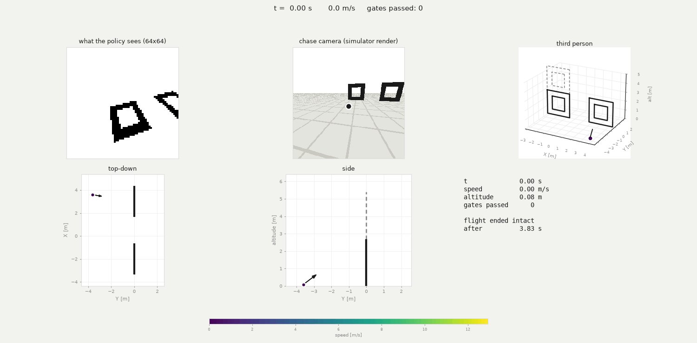
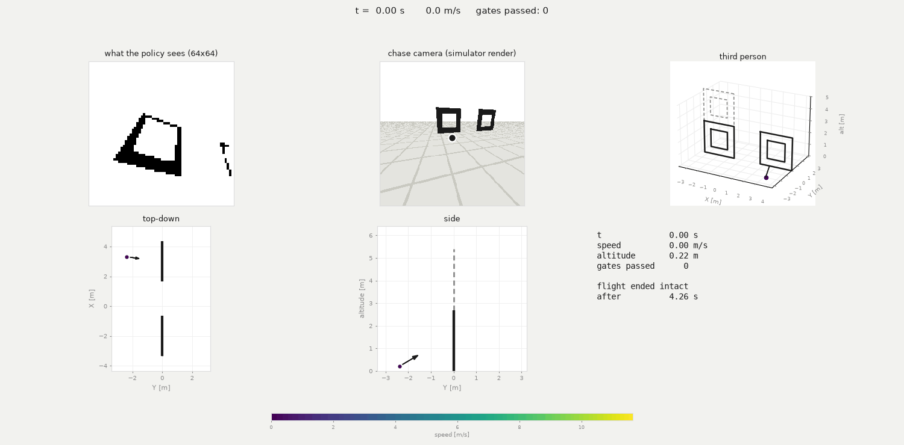
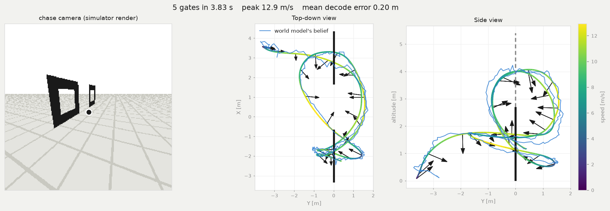
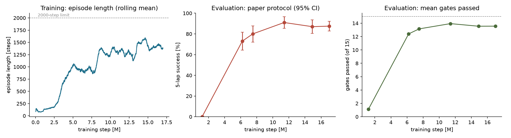
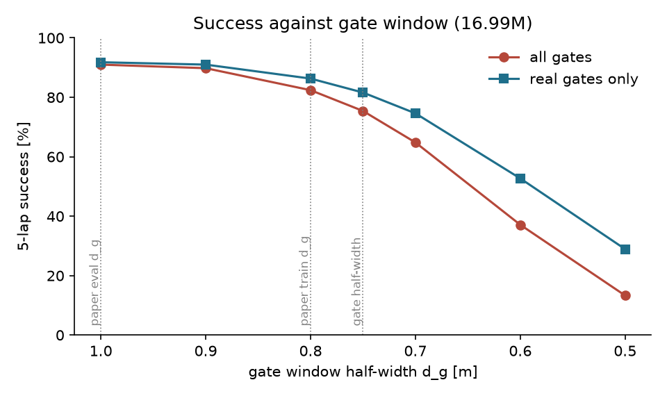

# SkyDreamer — DreamerV3 drone racing with direct motor control

A policy that flies a drone through gates from a gate-segmentation mask and gyro/RPM
readings, outputting the four motor commands directly. A DreamerV3 world model with an
informed (privileged-state) decoder is the state estimator. Method:
[SkyDreamer, arXiv:2510.14783](https://arxiv.org/abs/2510.14783), rebuilt from the paper alone.

## Simulation results

Inverted-loop track (3 gates per lap, one virtual gate), checkpoint at 16.99M steps,
200 episodes x 5 laps, evaluation as in the paper (Table III evaluation column, every
episode from the start gate).

| | this work | paper (Table IV) |
|---|---|---|
| 5-lap success | **87.5%** (175/200, 95% CI ±4.6) | 100% |
| lap 1 time | 1.93 s | 3.37 s |
| laps 2-5 time | 2.24 s | 3.25 s |
| peak speed, mean over episodes | 12.8 m/s | 13 m/s |
| peak acceleration, mean over episodes | 6.2 g | 6 g |
| peak speed / acceleration, maximum | 17.9 m/s / 10.4 g | — |
| mean distance from gate centre at crossing | 0.32 m | — |
| world-model position error (decoded vs true) | 0.14 m whole flight, 0.25 m first 20 steps | — |
| world-model velocity error | 0.67 m/s whole flight | — |

Episode outcomes: 175 complete five laps, 17 hit the ground, 8 hit a gate. 14 of the 25
failures are in the first two gates.




Two laps, 16.99M checkpoint. Panels: the mask the policy receives, 3D view, top-down and
side views coloured by speed.



Ground truth (colour) against the world model's decoded position (blue), 0.20 m mean error.
Arrows are the camera axis.

### Training

17M steps, three phases (defaults; `batch_length` 256 from 8M; entropy 1e-5 and lr 2e-6
from 13M), `size12m`, `train_ratio` 128. World model initialised from an earlier run,
actor-critic from scratch, replay seeded with 800 expert episodes (2000 steps each, 5-9
gates).



| step | success | gates passed (of 15) | position error [m] | episodes |
|---|---|---|---|---|
| 1.2M | 0% | 1.12 | 1.59 | 100 |
| 6.2M | 73% | 12.40 | 0.25 | 100 |
| 7.5M | 80% | 13.15 | 0.20 | 100 |
| 11.4M | 91% | 13.94 | 0.17 | 100 |
| 14.9M | 87% | 13.55 | 0.15 | 100 |
| 17.0M | 87.5% | 13.56 | 0.14 | 200 |

Success is flat from 11M within the confidence interval (±5-6 points).

### Gate window

The simulator's gate window `d_g` is the paper's "effective gate size" (train 0.8 m,
evaluation 1.0 m). The track's gates are 1.5 m clear, 0.75 m half-width. The policy does not
observe `d_g`, so one set of flights scored at several windows gives the success at each.

| window half-width | 1.0 | 0.9 | 0.8 | 0.75 | 0.7 | 0.6 | 0.5 |
|---|---|---|---|---|---|---|---|
| success, all gates | 91.0% | 89.8% | 82.4% | 75.4% | 64.8% | 37.1% | 13.3% |
| success, real gates only | 91.8% | 91.0% | 86.3% | 81.6% | 74.6% | 52.7% | 28.9% |



Evaluation protocols (`scripts/evaluate.py --protocol`), same checkpoint, 200 episodes:

| protocol | definition | success |
|---|---|---|
| `paper` | Table III evaluation column, start gate, d_g 1.0 m | **87.5%** |
| `strict` | as `paper`, d_g 0.8 m | 77.5% |
| `mixed` | 70% training column, random start gate | 56.0% |

### Limits

- Success is 87.5%, not the paper's 100%.
- Peak speed and acceleration in the best episodes exceed the paper's figures
  (17.9 m/s, 10.4 g).
- The Figure 9 track, flown zero-shot, is not completed: 0/100.
- Simulation only; no real flight.

## Run

```bash
./run.sh --smoke                          # ~5 min, whole pipeline on a tiny model
./run.sh --collect-demos                  # expert demonstrations -> demos/
./run.sh --warm-start <ckpt> --demos demos   # the recipe above
./run.sh                                  # plain 17M-step run from scratch
./run.sh --resume                         # continue the newest run
./run_test.sh                             # score + render the newest checkpoint, also mid-training
./run_test.sh --protocol strict           # paper | strict | mixed | physical
```

Needs an NVIDIA GPU (24 GB, BF16-capable), `git` and `curl`; `run.sh` installs the rest.
Logs and evaluations land in `logdir/<run>/`.

## Our drone and gate

`./run.sh --hw` trains on our flight-test hardware (2.1 m gate frame, camera 10 cm forward,
114.6° x 92.15° field of view, thrust-to-weight 4.3) and `./run_test.sh` scores such a run
with the `physical` protocol. See [`docs/hardware.md`](docs/hardware.md).

## Layout

```
skydreamer/        dynamics, track, mask renderer, informed-POMDP env, hardware profile
scripts/           train, evaluate, visualize, collect_demos, make_readme_figs
patches/           informed decoder + smoothness loss for DreamerV3 (cdf5709)
tests/             121 tests, including a paper-conformance audit
docs/              paper_gaps.md, deviations.md, hardware.md, datasets.md
docs/results/      figures above
```
